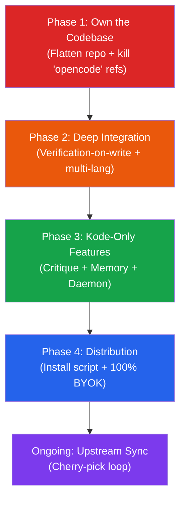

# KODE — Battle Plan v2: The Verified Coding Agent

> **Strategic pivot:** Stop chasing feature parity with Cursor/Copilot. Win the market they're ignoring — developers and teams who need AI coding they can *trust*.

---

## Strategic Reality Check

### The Competitive Landscape (May 2026)

| Incumbent | Funding | Team | Users | Thesis |
|-----------|---------|------|-------|--------|
| Cursor | $400M+ | 50+ | ~1M+ | "Fastest AI autocomplete in an IDE" |
| GitHub Copilot | Microsoft (∞) | 100+ | 1.8M+ | "AI pair programmer for everyone" |
| Windsurf | $150M+ | 100+ | 700K+ | "AI-native IDE" |
| Augment | $252M | 50+ | Growing | "Enterprise AI coding" |
| **Kode** | **$0** | **1** | **Pre-launch** | **"The AI coding agent that verifies before it writes"** |

### Why Kode Can Still Win

You cannot out-autocomplete Cursor. You cannot out-spend Microsoft. **But none of them solve the #1 fear stopping enterprise adoption: trust.**

Every incumbent uses generate-and-pray. Kode uses **Plan → Critique → Generate → Verify → Apply → Test**. That's not a feature — it's a fundamentally different architecture. The buyers who care about this are:

- **Enterprise security teams** that banned Copilot
- **Regulated industries** (fintech, healthcare, defense) where unverified AI is a liability
- **Platform teams** enforcing architectural boundaries across microservices
- **Solo founders** who can't afford a broken production deploy

### Kode's Actual Moat (What We Have Today)

| Asset | Status | Why It Matters |
|-------|--------|---------------|
| Go Gatekeeper (5-gate verification) | ✅ 10 test packages passing | No incumbent has deterministic pre-write verification |
| Ghost Engine (parallel speculative branching) | ✅ Working | Genuinely novel — parallel worktrees with self-healing retry |
| Blindfold Mode (SHA-256 obfuscation) | ✅ Working | Enterprise catnip — solves CISO objection #1 |
| Blast Radius analysis | ✅ Working | Prevents runaway refactors before they happen |
| Full TUI (opencode fork, 158 files rebranded) | ✅ Working | Complete agent UX for free |
| Golf Gate (benchmark regression) | ✅ Working | Performance safety net no one else offers |
| Live website (trykode.xyz) | ✅ Deployed | Professional presence |

---

## The Vendored Codebase: Full Ownership Plan

> **Principle:** The vendored OpenCode codebase is not technical debt — it's the foundation. But it must become *ours*, not a dependency we're afraid to touch.

### Current State

```
c:\kode
├── cmd/kode/              ← 100% ours (Go CLI)
├── internal/              ← 100% ours (Go engine, 17 packages)
├── vendored/opencode/     ← ⚠️ ABSORBED BUT NOT OWNED
│   ├── packages/
│   │   ├── opencode/      ← Still named "opencode"
│   │   ├── core/          ← ~21 files reference "opencode"
│   │   ├── llm/
│   │   ├── ui/
│   │   └── app/
│   └── package.json
├── web/                   ← 100% ours (React landing page)
└── go.mod
```

**Problems with current state:**
1. Directory name `vendored/opencode/` signals "someone else's code"
2. ~83 files still reference "opencode" in identifiers, configs, paths
3. Package literally named `packages/opencode/` — not `packages/kode/`
4. No clear boundary between "files we modified" vs "files identical to upstream"
5. Cherry-picking upstream fixes requires navigating the `vendored/` indirection

### Phase 1A: Repository Flattening (Days 1-2)

**Goal:** Eliminate the `vendored/` layer entirely.

```
BEFORE:                              AFTER:
c:\kode                              c:\kode
├── cmd/kode/                        ├── cmd/kode/
├── internal/                        ├── internal/
├── vendored/                        ├── packages/         ← OWNED
│   └── opencode/                    │   ├── kode/         ← was opencode/
│       ├── packages/                │   ├── core/
│       │   ├── opencode/            │   ├── llm/
│       │   ├── core/                │   ├── ui/
│       │   └── ...                  │   └── app/
│       └── package.json             ├── package.json      ← workspace root
├── web/                             ├── web/
└── go.mod                           └── go.mod
```

**Step-by-step execution:**

1. **Move packages up:**
   ```powershell
   mv vendored/opencode/packages/* packages/
   mv vendored/opencode/package.json ./package.json.upstream
   mv vendored/opencode/bun.lock ./bun.lock
   mv vendored/opencode/tsconfig.json ./tsconfig.json
   ```

2. **Rename the main package:**
   ```powershell
   mv packages/opencode packages/kode
   ```

3. **Update Go bridge paths** in `cmd/kode/tui.go` and `cmd/kode/proxy.go`:
   - Change all `vendored/opencode/packages/` → `packages/`
   - Change working directory for `bun run` to project root

4. **Update workspace `package.json`:**
   - Merge upstream workspace config with any existing root config
   - Update workspace globs: `"workspaces": ["packages/*", "web"]`

5. **Update `tsconfig.json` path aliases:**
   - `@opencode/*` → `@kode/*`
   - `@/` source root → `packages/kode/src/`

6. **Update `netlify.toml`** build command if needed

7. **Delete empty `vendored/` directory**

8. **Prune unused packages** (if any exist): `enterprise/`, `desktop/`, `containers/`, `storybook/`, `console/`, `identity/`, `function/`, `docs/` — anything Kode doesn't use

### Phase 1B: Kill Every "opencode" Reference (Days 3-5)

**Goal:** `rg -i "opencode" packages/ -l` returns **zero results**.

**Systematic sweep by category:**

| Category | Where | What to Change |
|----------|-------|---------------|
| **Package names** | All `package.json` files | `"opencode"` → `"kode"`, `@opencode-ai/*` → `@kode/*` |
| **Import paths** | ~20 files in `core/src/` | `@opencode/` → `@kode/` |
| **Config detection** | `core/src/project.ts`, `config.ts` | `.opencode/` → `.kode/`, `opencode.json` → `kode.json` |
| **Data directories** | `core/src/global.ts`, `location.ts` | `~/.opencode` → `~/.kode` |
| **Provider IDs** | `core/src/plugin/provider/` | `opencode` provider refs → `kode` |
| **Process names** | `core/src/process.ts` | `"opencode"` process ID |
| **User-agent headers** | `provider/provider.ts` | Finish stragglers |
| **Test fixtures** | `core/test/` — ~17 files | Update fixture data |
| **System prompts** | `src/session/prompt/` | Any "OpenCode" in agent identity |
| **Comments & docs** | Throughout | Final search-and-replace pass |

**Verification gates:**
```bash
# Gate 1: Zero references in source
rg -i "opencode" packages/ --type ts -l
# Expected: 0 results

# Gate 2: Zero references in config
rg -i "opencode" packages/ -g "*.json" -l
# Expected: 0 results

# Gate 3: Build succeeds
cd packages/kode && bun run build

# Gate 4: TUI launches
kode tui
```

### Phase 1C: Ownership Documentation (Day 6)

Create `UPSTREAM.md` at repo root:

```markdown
# Upstream Tracking

Base: anomalyco/opencode @ v1.15.10 (commit <sha>)
Fork date: 2026-05-XX
Last upstream sync: 2026-05-XX

## File Classification

### Kode-Only (never conflicts with upstream)
- cmd/kode/           — Go CLI
- internal/           — Go verification engine
- web/                — React landing page
- packages/kode/src/bridge/  — Go↔TS IPC

### Modified from Upstream (cherry-pick carefully)
- packages/kode/src/tool/edit.ts     — verification hooks
- packages/kode/src/tool/write.ts    — verification hooks
- packages/kode/src/provider/        — Kode provider added
- packages/kode/src/agent/           — Kode identity prompts
- packages/kode/src/session/prompt/  — Rebranded prompts
- [158 total files modified for rebrand]

### Upstream-Identical (safe to cherry-pick)
- Everything else in packages/
```

### Phase 1D: Upstream Sync Process (Ongoing)

**Cherry-pick protocol (never rebase):**

1. Add upstream remote: `git remote add upstream https://github.com/anomalyco/opencode.git`
2. For each upstream release:
   - `git fetch upstream`
   - Review changelog for: bug fixes (take), new providers (take), new tools (evaluate), architecture changes (evaluate carefully)
   - `git cherry-pick <commit>` for each wanted change
   - Resolve conflicts against our modifications
   - Run full test suite before merging
3. Update `UPSTREAM.md` with sync date and cherry-picked commits
4. **Budget: ~2-4 hours per upstream release**

---

## Phase 2: Deep Engine Integration (Weeks 2-4)

> **Goal:** Verification-on-write. Every file the LLM touches passes through the Go Gatekeeper before hitting disk. This is the *entire product thesis*.

### 2.1 — Verification-on-Write (THE Core Differentiator)

**Effort:** 3-5 days

The bridge exists (`src/bridge/gatekeeper.ts`). It's currently opt-in. Make it **automatic and invisible**.

**Hook into every file-writing tool:**
- `src/tool/edit.ts` — after generating edit, before disk write → `Gatekeeper.verify()`
- `src/tool/write.ts` — same pattern
- `src/tool/apply_patch.ts` — same pattern
- On verification failure: return error to LLM as tool result → LLM self-corrects

**Config in `kode.json`:**
```json
{
  "verify": {
    "enabled": true,
    "gates": ["syntax", "imports", "calls"],
    "block_architecture": false,
    "auto_retry": 2
  }
}
```

**TUI integration:**
- `[✓ verified]` or `[✗ 2 gates failed]` badge on each file edit
- `KODE_GATE: <name>` progress events rendered as spinner

### 2.2 — Ghost Branches in TUI

**Effort:** 3-4 days

Expose `internal/ghost/` in the TUI:
- Config: `"ghost": { "enabled": true, "branches": 3 }`
- Show "Speculating..." indicator with branch scores
- User picks winner or accepts auto-selected

### 2.3 — Multi-Language Verification (Priority: TS + Python)

**Effort:** 5-7 days

The current engine uses `go/parser` (Go-only). Extend via tree-sitter:

1. Add `github.com/smacker/go-tree-sitter` bindings
2. Create `internal/graph/queries/`:
   - `typescript.scm` — function/class defs, imports
   - `python.scm` — function/class defs, imports
   - `rust.scm` — function/impl defs, use statements
3. Refactor verification gates to accept tree-sitter nodes
4. Auto-detect language from file extension

**This is critical.** A Go-only verifier limits the addressable market to Go projects. TypeScript and Python support unlocks 80%+ of the developer population.

---

## Phase 3: Kode-Only Features (Weeks 4-6)

> **Goal:** Build what the incumbents will never build.

### 3.1 — Critique Engine

Implement `internal/critique/` lenses:
- **Blast Radius Lens** — Reject patches touching >N files
- **Coherence Lens** — Flag hunks mixing unrelated concerns
- **Convention Lens** — Check naming/import conventions
- **Dependency Lens** — Flag new external dependencies

Wire into session: after LLM generates tool calls, before execution, run critique.

### 3.2 — Session Memory

Persist per-project intelligence in `.kode/memory.db` (SQLite):
- Verification failure patterns → smarter prompting
- User override preferences
- Blast radius trends
- Successful ghost branch strategies

### 3.3 — Daemon Mode

`internal/daemon/` watches git commits, proactively suggests refactors:
- Background process via `kode daemon`
- IPC notifications to TUI
- User can accept, dismiss, or defer suggestions

### 3.4 — MCP Server Mode

```bash
kode mcp serve
```

Expose Kode's verification as tools other agents can call:
- `kode_verify` — Run 5-gate check on a file
- `kode_plan` — Build context graph
- `kode_critique` — Run critique lenses

---

## Phase 4: Distribution (Weeks 6-8)

### 4.1 — Unified Install

```bash
curl -fsSL https://trykode.xyz/install | bash
```

Ship two binaries:
- `kode` — Go engine + CLI (~10MB)
- `kode-tui` — Compiled TS binary (via `bun build --compile`)

`kode tui` auto-downloads `kode-tui` on first run (already implemented).

### 4.2 — 100% BYOK & Cloud Decoupling

Since we are not deploying a funded cloud gateway right now, Kode will operate as a pure "Bring Your Own Key" (BYOK) local agent.
- Disable/remove the upstream `/connect` and `/share` commands from the TUI to prevent data leakage to `opencode.ai`.
- Ensure the agent natively supports local `.env` keys for OpenAI, Anthropic, and Gemini.
- Keep the agent 100% local, secure, and free.

---

## Execution Priority



> [!IMPORTANT]
> **Phase 1 is non-negotiable.** You cannot build deep integrations while the code lives in `vendored/opencode/` with 83 files still saying "opencode." The directory structure itself signals "this is a wrapper." Flatten it. Own it. Then diverge.

---

## Timeline

| Phase | Duration | Deliverable | Milestone |
|-------|----------|-------------|-----------|
| **1: Own** | Week 1-2 | Flat repo, 0 "opencode" refs, `UPSTREAM.md` | "It's ours" |
| **2: Integrate** | Week 2-4 | Verify-on-write, multi-lang, ghost in TUI | "It's different" |
| **3: Diverge** | Week 4-6 | Critique, memory, daemon, MCP server | "It's better" |
| **4: Ship** | Week 6-8 | Install script, gateway, polished site | "You can use it" |
| **5: Maintain** | Ongoing | Cherry-pick upstream, track divergence | "It stays current" |

---

## The Permanent Divergence Table

After all phases, this is why Kode ≠ OpenCode ≠ Cursor ≠ Copilot:

| Capability | Copilot/Cursor | OpenCode | **Kode** |
|-----------|----------------|----------|----------|
| File writes | Direct to disk | Direct to disk | **5-gate verified, then disk** |
| Error recovery | LLM retries | LLM retries | **LLM retries + snapshot rollback** |
| Task strategy | Single attempt | Single attempt | **Ghost branches: N strategies, best wins** |
| Pre-write review | None | None | **Critique lenses before generation** |
| Performance guard | None | None | **Golf gate: benchmark regression detection** |
| Background intel | None | None | **Daemon: watches git, suggests refactors** |
| Session memory | Stateless | Stateless | **Cross-session learning (SQLite)** |
| Code privacy | Sent to cloud | Sent to cloud | **Blindfold: SHA-256 obfuscation** |
| Verify languages | N/A | N/A | **Go, TS, Python, Rust (tree-sitter)** |
| Other agents | Walled garden | N/A | **MCP server: verification oracle** |

> [!CAUTION]
> **The single most important thing is Phase 2.1 — verification-on-write.** This is the entire thesis. Without it, Kode is just a rebranded OpenCode. With it, Kode is a fundamentally different product that solves a problem no incumbent even acknowledges.

---

## The Bottom Line

Kode won't beat Cursor at being Cursor. It will beat everyone at being the **safe** AI coding agent — the one enterprises trust, the one that doesn't break production, the one where every patch passes 5 gates before touching your codebase.

That's not a small market. That's the entire market sitting on the sidelines because they don't trust the incumbents.
